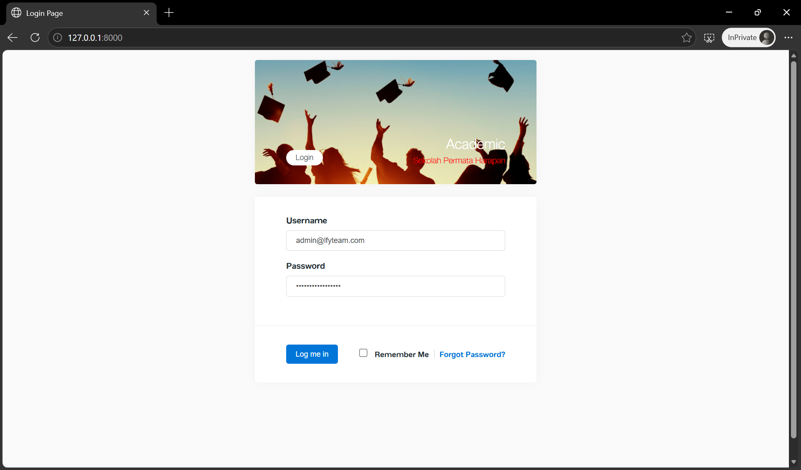
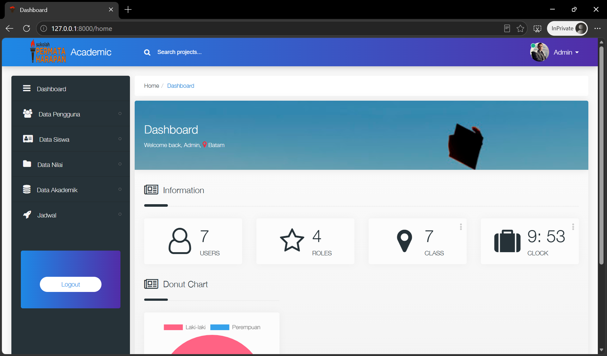
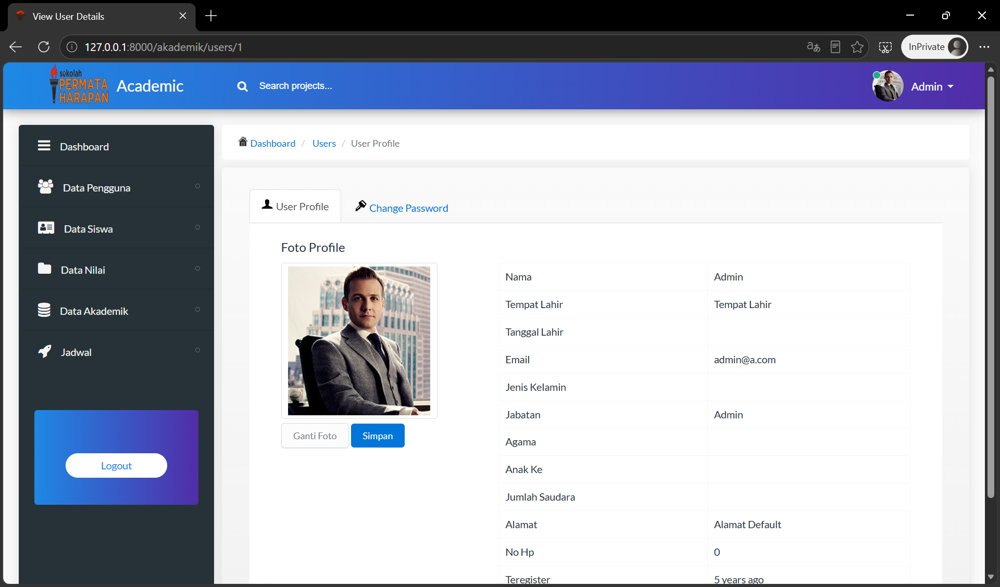
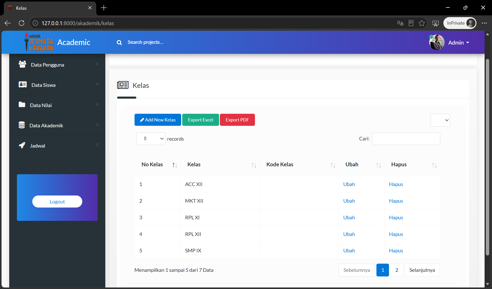

# Akademik - Academic Management System

A web-based academic/student management system built with **Laravel 6**, **PHP**, **MySQL**, and **Bootstrap**. 
Developed as a collaborative team project during my time in SMK Permata Harapan Batam (Vocational High School in Batam, Indonesia)

## Features
- Student enrollment and profile management
- Course registration and scheduling
- Grade recording and transcript generation
- Role-based access control (Admin / Teacher / Student)
- Responsive UI for desktop and mobile

## Tech Stack
- **Backend:** Laravel 6 (PHP 7.x), MySQL
- **Frontend:** HTML5, CSS3, JavaScript, Bootstrap 4
- **Tools:** Git, Composer, XAMPP

## My Role
- Designed and implemented the database schema (ERD → MySQL)
- Built the backend API routes and controllers for student/course modules
- Integrated frontend templates with Blade engine
- Collaborated with team members using Git for version control

## Screenshots

## Setup (Local)
1. Clone: `git clone https://github.com/MitanEXE/akademik.git`
2. Install: `composer install`
3. Configure `.env` with your database credentials
4. Import SQL File: `sistem.sql`
5. Serve: `php artisan serve`

## Notes
This project was developed in 2024 as part of an academic assignment. 
The codebase reflects my understanding of MVC architecture, RESTful routing, and relational database design at that stage of my studies.
